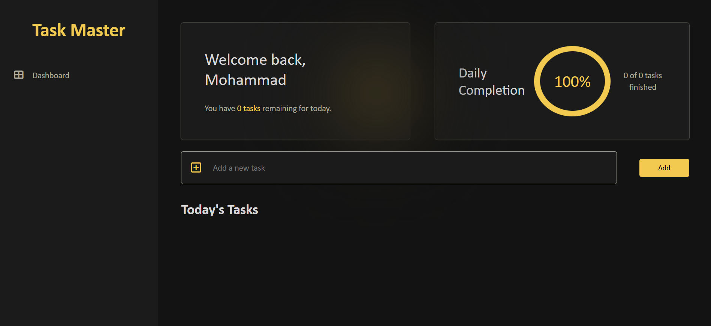

# 📋 Task Master to-do List

Task Master is a modern, lightweight task management web application designed to help users organize and track their daily to-dos efficiently with an intuitive and stylish dark-mode interface.

---

## ✨ Features

* **Personalized Dashboard:** Welcomes users and displays real-time task status.
* **Daily Completion Tracker:** Visual circular progress tracker showing completed vs. total daily tasks.
* **Task Management:**
  * **Add Tasks:** Easily add new tasks for the day.
  * **Complete Tasks:** Mark tasks as finished with dynamic percentage updates.
  * **Delete Tasks:** Remove completed or obsolete tasks instantly.
* **Sleek UI:** Clean dark-mode aesthetic with modern accent colors for a fast and smooth user experience.

---

## 🛠️ Tech Stack

* **HTML5:** Semantic layout and structure.
* **CSS3:** Custom styling, dark mode theme, and responsive UI components.
* **JavaScript (ES6+):** Dynamic DOM manipulation, task state handling, and progress calculations.

---

## 📝 License
Distributed under the MIT License.
